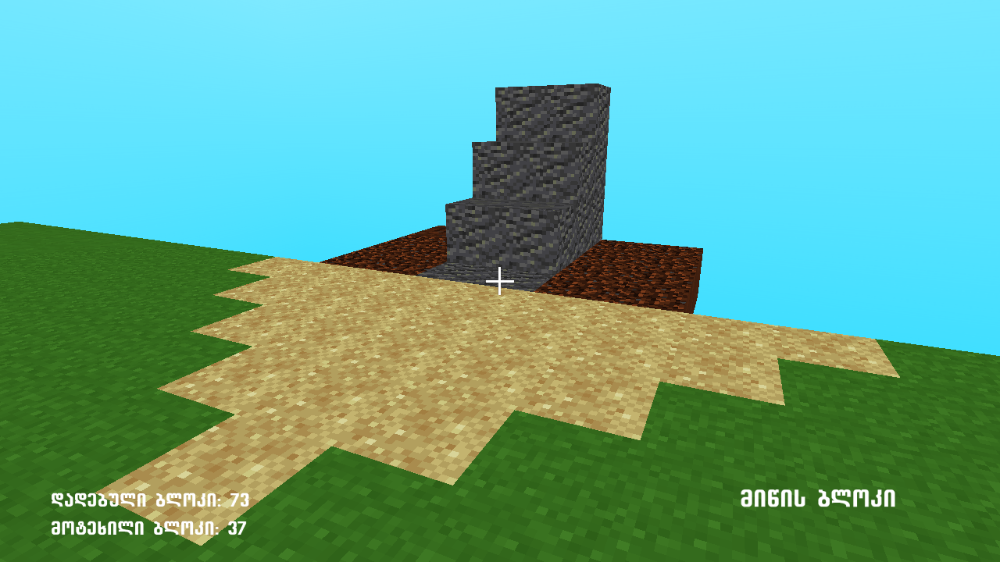

Geocraft - Georgian Minecraft Clone / Qartuli Minecraft Kloni / ქართული მაინქრაფტის კლონი

Guide [EN]:

Game is simple pre-generated terrain where you can place and break blocks.
You have 4 blocks to choose from:
1. Grass Block [Key: 1]
2. Dirt Block [Key: 2]
3. Sand Block [Key: 3]
4. Stone Block [Key: 4]

   Game has no GUI (not yet) - only three labels
   which tell you the amount of blocks you've placed and amount
   you've broken, third one is for keeping track of the block you're
   currently holding.

   
ინსტრუქცია [KA]:

თამაში არის წინასწარ-გენერირებული პლატფორმა სადაც შეგიძლია
განათავსო / მოტეხო ბლოკები.

სულ არის 4 ბლოკის ვარიანტი:
1. ბალახის ბლოკი [კლავიში: 1]
2. მიწის ბლოკი [კლავიში: 2]
3. ქვიშის ბლოკი [კლავიში: 3]
4. ქვის ბლოკი [კლავიში: 4]

   თამაშს არ აქვს ინტერფეისი (მენუ) - მხოლოდ სამი მანიშნებელი ტექსტი
   რომლებიც გეუბნება თუ რამდენი ბლოკი გაქვს დადებული / მოტეხილი
   სესიის განმავლობაში, მესამე კი გიჩვენებს რა სახის ბლოკი გაქვს არჩეული
   ამ მომენტში.
   

Full Manual / სრული ინსტრუქცია: https://geocraft.neocities.org

Assets from: https://github.com/cbttrevor